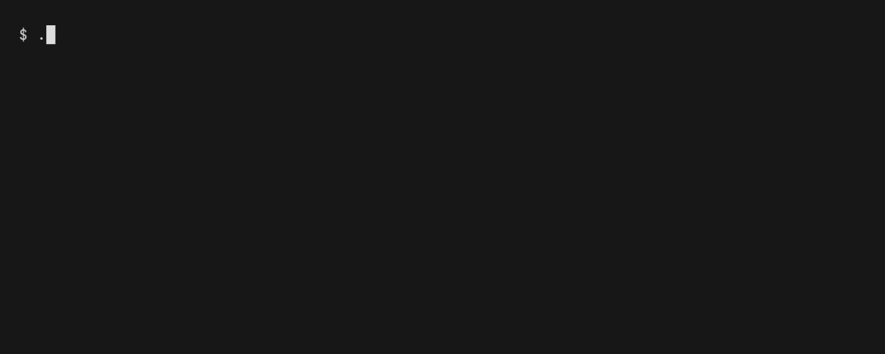

# ttm

[](https://github.com/bumaruf/ttm-cli/actions/workflows/ci.yml)
[](https://www.npmjs.com/package/@bumaruf/ttm-cli)

A TUI for picking a GNOME Terminal color theme — the window running it is the preview.



<!--
Re-record with: bun run build && vhs demo.tape
Note: the GIF is recorded through ttyd, which ignores OSC 11, so the background
does not change on screen. In a real GNOME Terminal the whole window repaints.
-->

As you move through the list, `ttm` repaints the terminal window you're sitting in — live — with the real colors of the highlighted theme. Nothing is written to disk while you browse. Press `Esc` and the window snaps back to whatever it looked like before you started, as if nothing happened. Press `Enter` and the theme is applied for real, and the window is left showing it, without reopening anything.

## Install

```bash
# npm (requires Bun)
npm i -g @bumaruf/ttm-cli

# prebuilt binary — self-contained, no runtime needed
curl -fsSL https://github.com/bumaruf/ttm-cli/releases/latest/download/ttm-linux-x64 -o ttm
chmod +x ttm
sudo mv ttm /usr/local/bin/ttm

# Debian/Ubuntu
sudo dpkg -i ttm_<version>_amd64.deb
```

The command is `ttm` however you install it.

Until then, build from source (see [Development](#development) below).

## Usage

Run `ttm` with no arguments to open the picker:

```
ttm
```

| Key | Action |
| --- | --- |
| `↑` / `↓` | Move through the theme list, repainting the window live |
| type | Filter the list (fuzzy, case-insensitive) |
| Backspace | Delete a character from the filter |
| `Enter` | Apply the highlighted theme and exit |
| `Esc` / `Ctrl-C` | Cancel, restore the original colors, and exit |

Subcommands, for scripting or checking state without the picker:

```
ttm                 open the picker
ttm list            list available themes
ttm current         print the active theme
ttm apply <name>    apply a theme by name
ttm --help          show this help
```

## Adding a theme

A theme is a single TOML file in `themes/`. Drop one in and it shows up in the picker — no code changes needed. Here's `themes/nord.toml` in full, as a template:

```toml
name = "Nord"
background = "#2e3440"
foreground = "#d8dee9"
palette = [
  "#3b4252", "#bf616a", "#a3be8c", "#ebcb8b",
  "#81a1c1", "#b48ead", "#88c0d0", "#e5e9f0",
  "#4c566a", "#bf616a", "#a3be8c", "#ebcb8b",
  "#81a1c1", "#b48ead", "#8fbcbb", "#eceff4",
]
```

`palette` is the 16-color ANSI palette (colors 0–15, in order). `background` and `foreground` are the default pane colors.

## How it works

While the picker is open, moving the selection sends OSC 4 escape sequences to set the 16 palette colors and OSC 10/11 to set the foreground and background — directly to the terminal you're running `ttm` in. That's the whole trick: the preview isn't a rendering of the theme, it's the actual terminal repainting itself in real time. Nothing touches disk during this. If you cancel (`Esc` or `Ctrl-C`), `ttm` sends the original colors back and the window looks exactly as it did before you ran the command — you can flip through ten themes and leave no trace.

If you press `Enter`, `ttm` writes the theme into GNOME Terminal's dconf settings and makes it the default profile — but it deliberately does *not* reset the window's colors first. The window is already showing the theme you just picked, so the change appears to take effect instantly, everywhere, without reopening a single terminal.

## Compatibility

`ttm` currently supports GNOME Terminal (VTE-based terminals that honor dconf profiles and OSC 4/10/11). Support for another terminal emulator means implementing the `Backend` interface in [`src/backend.ts`](src/backend.ts):

```ts
export interface Backend {
  list(): Promise<string[]>;
  current(): Promise<string | null>;
  apply(theme: Theme): Promise<void>;
}
```

Nothing else in the codebase needs to change — the picker, the live preview, and the theme format are all backend-agnostic.

## Development

```bash
bun install
bun test
bun run typecheck
bun run build
```

`ttm` has zero runtime dependencies. It's written in TypeScript, run and built with [Bun](https://bun.sh), and compiled to a standalone binary via `bun build --compile`.

See [CONTRIBUTING.md](CONTRIBUTING.md) for how to contribute.

## License

[MIT](LICENSE) © 2026 Otávio Bumaruf
